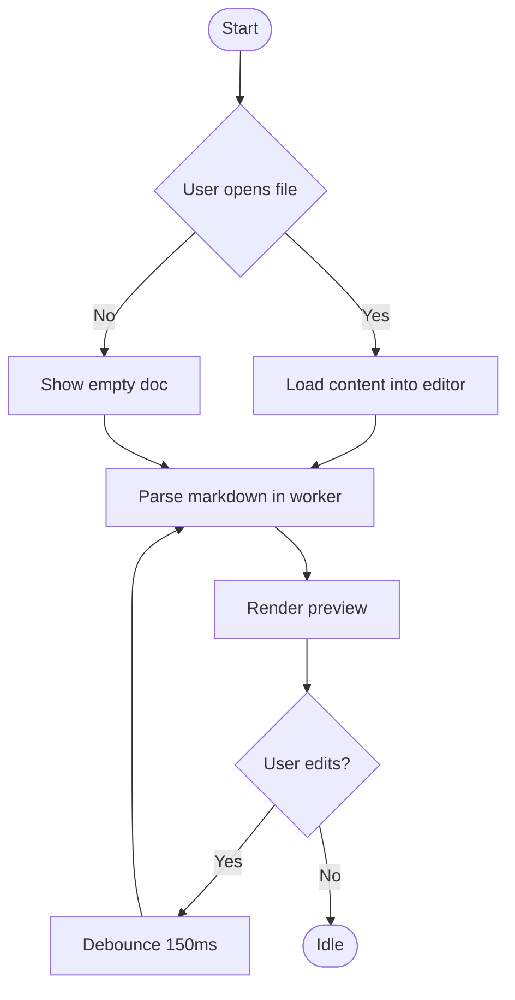
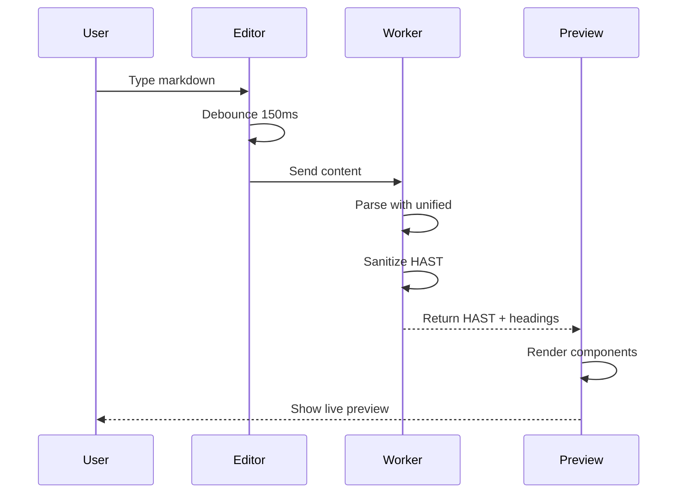
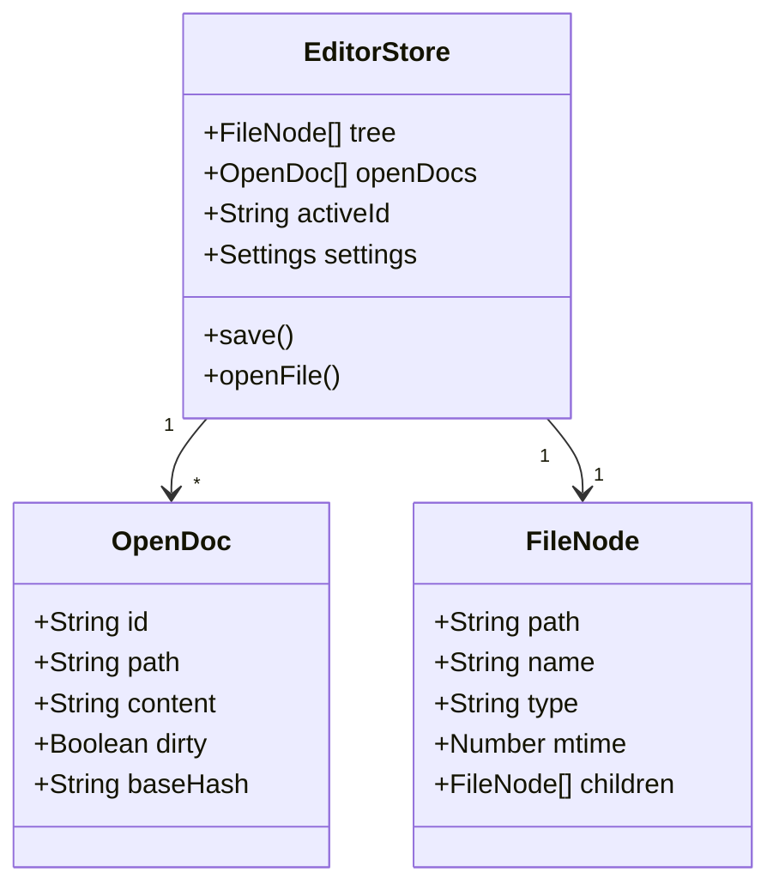
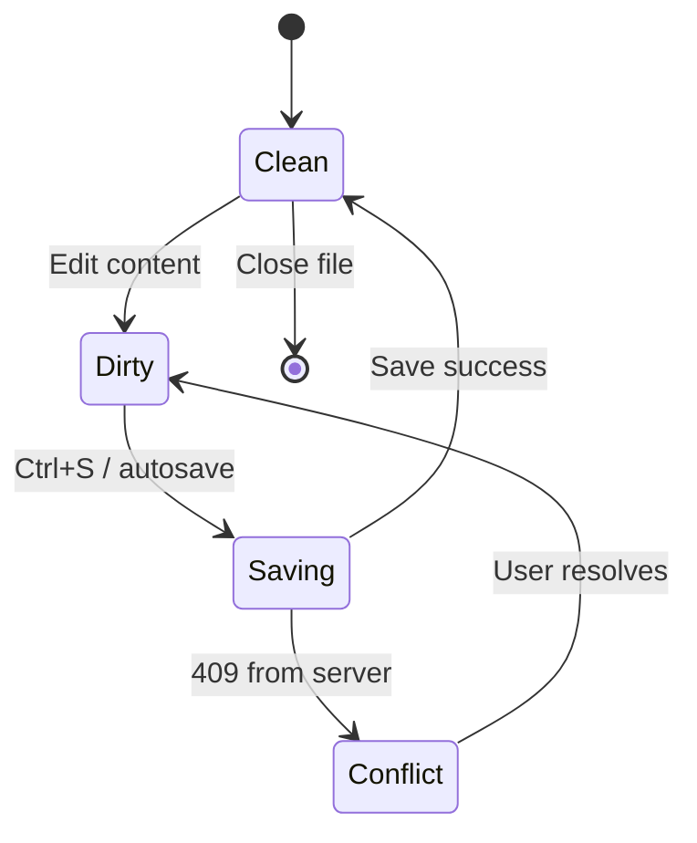
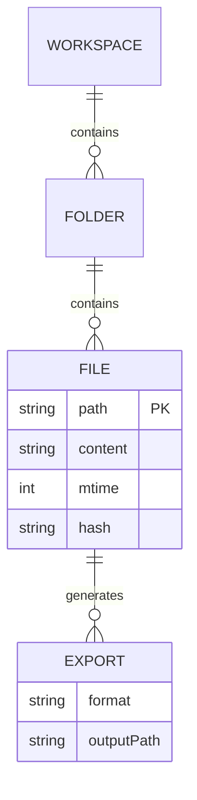
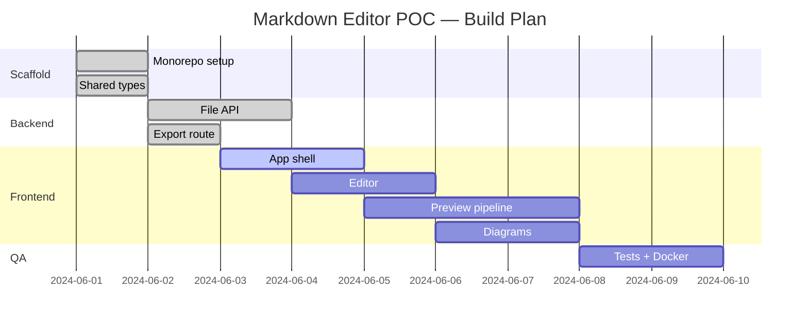
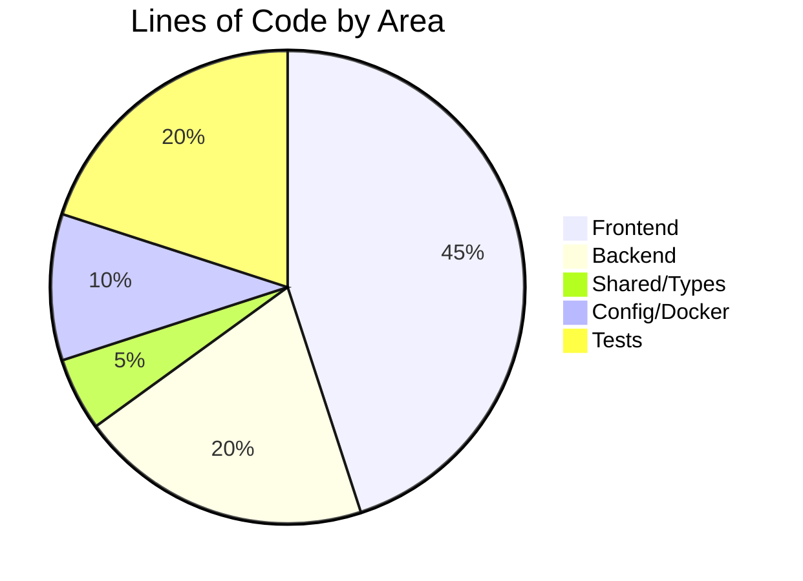
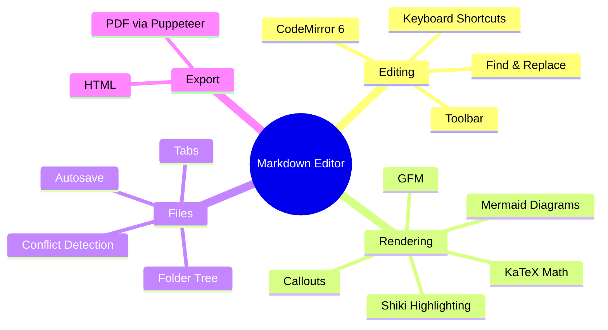

# Welcome to the Markdown Editor :wave:

This document demonstrates every feature of the editor. Open it, edit it, and watch the live preview update in real time.

---

## Text Formatting

You can write **bold**, *italic*, ~~strikethrough~~, and `inline code`. Combine them: **_bold italic_**.

Here is a [link to the Mermaid docs](https://mermaid.js.org) and an auto-link: https://github.com

---

## GitHub-Flavored Markdown

### Tables

| Feature          | Status  | Notes                      |
|------------------|---------|----------------------------|
| GFM Tables       | ✅ Done  | Sortable in SHOULD tier    |
| Task Lists       | ✅ Done  | Interactive checkboxes     |
| Footnotes        | ✅ Done  | See below[^1]              |
| Strikethrough    | ✅ Done  | Using `~~text~~`           |

### Task Lists

- [x] Scaffold project
- [x] Build file API
- [ ] Add unit tests
- [ ] Deploy to production

### Footnotes

This sentence has a footnote.[^1]

[^1]: Footnotes appear at the bottom of the rendered document.

---

## Callouts / Admonitions

> [!NOTE]
> This is a **note** callout — useful for informational messages.

> [!WARNING]
> This is a **warning** callout — draws attention to potential issues.

> [!TIP]
> This is a **tip** callout — helpful suggestions for the reader.

> [!IMPORTANT]
> This is an **important** callout — critical information.

---

## Code Blocks

```typescript
// TypeScript with Shiki syntax highlighting
interface MarkdownEditor {
  content: string;
  theme: "light" | "dark";
  render(): Promise<string>;
}

async function renderMarkdown(editor: MarkdownEditor): Promise<void> {
  const html = await editor.render();
  console.log(`Rendered ${html.length} bytes`);
}
```

```python
# Python example
def fibonacci(n: int) -> list[int]:
    seq = [0, 1]
    while len(seq) < n:
        seq.append(seq[-1] + seq[-2])
    return seq[:n]

print(fibonacci(10))
```

```bash
# Shell commands
docker compose up --build
curl http://localhost:3001/api/health
```

---

## Mathematics (KaTeX)

Inline math: The famous equation $E = mc^2$ describes mass-energy equivalence.

Block math:

$$
\int_{-\infty}^{\infty} e^{-x^2} \, dx = \sqrt{\pi}
$$

The quadratic formula:

$$
x = \frac{-b \pm \sqrt{b^2 - 4ac}}{2a}
$$

Maxwell's equations in differential form:

$$
\nabla \cdot \mathbf{E} = \frac{\rho}{\varepsilon_0}, \quad \nabla \times \mathbf{B} = \mu_0 \mathbf{J} + \mu_0\varepsilon_0\frac{\partial \mathbf{E}}{\partial t}
$$

---

## Mermaid Diagrams

### Flowchart



### Sequence Diagram



### Class Diagram



### State Diagram



### Entity Relationship



### Gantt Chart



### Pie Chart



### Mindmap



---

## Images

You can embed images using standard Markdown syntax:

```

```

Paste an image from your clipboard directly into the editor and it will be saved to `assets/`.

---

## Blockquotes

> "The best way to predict the future is to invent it."
> — Alan Kay

Nested blockquotes:

> First level
> > Second level
> > > Third level

---

*Happy writing!* :pencil:
